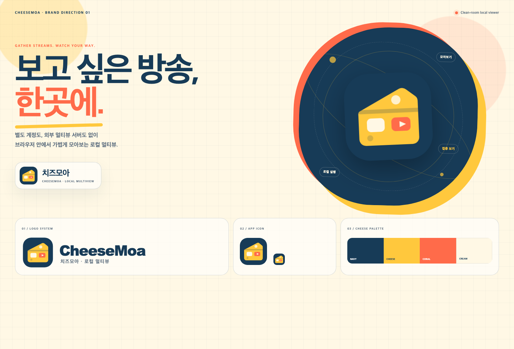
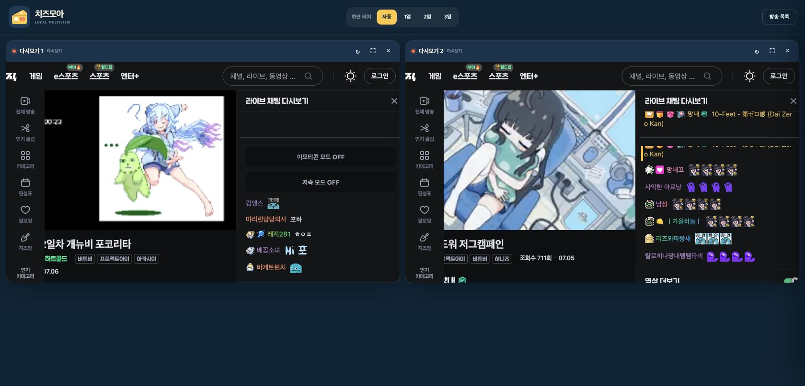

# 치즈모아 CheeseMoa

여러 CHZZK 라이브와 다시보기를 브라우저 한곳에 모아보는 로컬 Chrome 확장 프로그램입니다.
별도 계정, 외부 멀티뷰 서버, 원격 호스팅 없이 확장 프로그램 내부에서 실행됩니다.





## MVP 기능

- CHZZK 라이브 및 다시보기 링크 여러 개 입력
- 방송 수에 맞춘 1~3열 자동 그리드
- 개별 방송 새로고침, 제거, 전체화면
- 브라우저 로컬 저장소에 방송 목록 저장
- 외부 서버와 사용자 계정이 필요 없는 확장 프로그램 내장 뷰어
- Chrome에 이미 로그인된 CHZZK 세션 자동 사용

## 설치 및 실행

1. [Releases](https://github.com/ThankyouJerry/CheeseMoa/releases)에서 최신 ZIP을 내려받아 새 폴더에 압축을 풉니다.
2. Chrome 주소창에서 `chrome://extensions`를 엽니다.
3. 오른쪽 위 `개발자 모드`를 켭니다.
4. `압축해제된 확장 프로그램을 로드합니다`를 누르고 `manifest.json`이 있는 폴더를 선택합니다.
5. 도구 모음의 치즈모아 아이콘에서 CHZZK 링크를 추가합니다.

## 개발 확인

```bash
npm test
npm run validate
npm run build
```

`npm run build`는 `dist/`에 Chrome 배포용 ZIP, 압축해제 설치 폴더 및 SHA-256
체크섬을 생성합니다.

## 개인정보

입력한 방송 링크는 `chrome.storage.local`에만 저장됩니다. 치즈모아는 별도 분석 서버나
사용자 추적 도구를 사용하지 않습니다. CHZZK 로그인 쿠키는 Chrome이 직접 관리하며,
치즈모아는 쿠키 값을 읽거나 복사하거나 별도로 저장하지 않습니다.

## 안내

치즈모아는 CHZZK 또는 NAVER의 공식 서비스가 아닌 독립 오픈소스 프로젝트입니다.
각 방송과 콘텐츠의 권리는 원 저작권자에게 있으며, 서비스 이용약관과 저작권을 준수해야 합니다.
